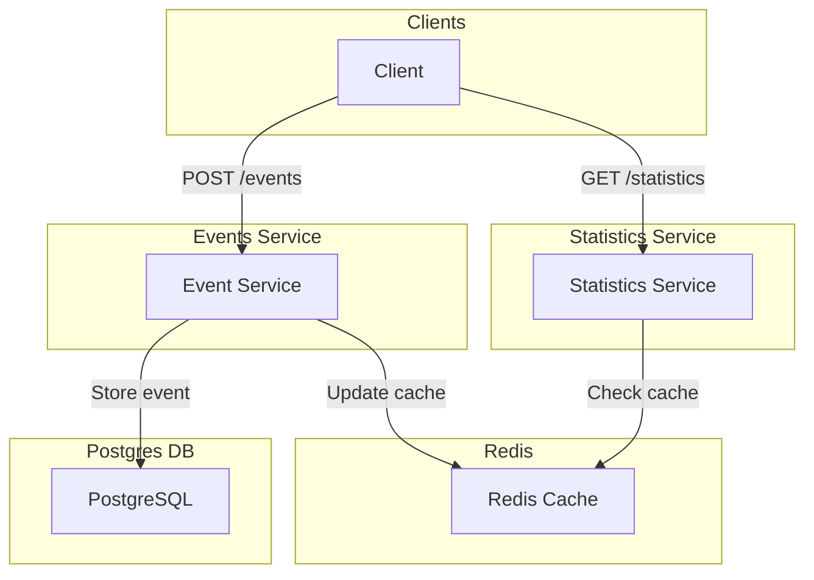

# Logging NBA Player Statistics system

## Overview
This system ingests basketball event data and aggregates statistics for players and teams. 
It uses Postgres for persistence and Redis for caching, enabling fast lookups and reliable historical aggregation.

## Architecture


## Consideration
It was decided to avoid in-memory calculations to make the system stateless to allow easier scaling.

## Assumptions
* A **game** is uniquely identified by its date. A player or team plays at most one game per day.
* An **event** is uniquely identified by player and timestamp (second-level resolution).
* The system supports idempotent ingestion -- repeated events don't corrupt data, but latest event override previously stored.
* All events are assumed to be submitted.

### Event Types
* Events include: `shot`, `rebound`, `assist`, `steal`, `block`, `foul`, `turnover`, `enter`, and `exit`.
* `shot` events are used to calculate `points` and contain a `points` attribute with values `1`, `2`, or `3`.
* `enter` and `exit` events are define court presence and used to calculate `minutes_played`. 

## Data Storage
### PostgreSQL
* Chosen for transactional safety and SQL aggregation.
* Estimated volumes of data allows using relational database.
* Postgres preferred to MySQL because of better performance
* Stores 
  * raw events
    * estimated number of events produced by a team during a game is about 200
    * estimated number of events during one game day: 15 games/day * 2 teams * 200 events/team = 6000 events per day
    * estimated number of events during a season: 180 days * 6000 events/day = 1080000 events per season
    * raw events can be purged after game day (not implemented yet)
  * aggregated players-by-game data
    * estimated number of records per day: 15 games/day * 2 teams * 10 players/team = 300 player-game records per day
    * estimated number of records per season: 180 days/season * 300 records/day = 54000 player-game records per season
    * players-by-game data can be purged at season end (not implemented yet)
  * players statistics per season
  * teams statistics per season
* Database tables are created on ingestion service startup.
* Corresponding DDL statements can be found in the [db.go](/events/internal/db.go) file 

### Redis (cache)
* Holds pre-aggregated stats for fast read access.
  * players statistics per season
  * teams statistics per season
* Updated as events are ingested.

## API Endpoints
### `POST /api/v1/event`

Ingest a new event:
```
{
  "player": "LeBron James",
  "team": "Los Angeles Lakers",
  "timestamp": "2025-03-15T18:45:00Z",
  "event": "enter"
}
```
```
{
  "player": "LeBron James",
  "team": "Los Angeles Lakers",
  "timestamp": "2025-03-15T18:45:00Z",
  "event": "shot",
  "points": 3
}
```
#### curl example
```
curl -X POST http://localhost:8081/api/v1/event -H "Content-Type: application/json" -d '{"player":"Antony Davis","team":"Los Angeles Lakers","timestamp":"2025-05-23T15:00:31Z","event":"shot","points":1}'
```


### `GET /api/v1/statistics/player/{player}/season/{season}`
Returns aggregated stats for a player in a season.

`GET  http://localhost:8080/api/v1/statistics/player/Antony%20Davis/season/2024-25`
```
{
    "points": 6,
    "rebounds": 0,
    "assists": 2,
    "steals": 1,
    "blocks": 1,
    "fouls": 6,
    "turnovers": 1,
    "minutesPlayed": 0.28333333
}
```

### `GET /api/v1/statistics/team/{team}/season/{season}`
Returns aggregated stats for a team in a season.

`GET  http://localhost:8080/api/v1/statistics/team/Los%20Angeles%20Lakers/season/2024-25`
```
{
    "points": 6,
    "rebounds": 0,
    "assists": 2,
    "steals": 1,
    "blocks": 1,
    "fouls": 6,
    "turnovers": 1,
    "minutesPlayed": 0.28333333
}
```

## Deployment Configuration
* Uses `docker-compose.yaml` with Postgres, Redis, and service containers.
* Each service has a dedicated Dockerfile.
* Services expose ports 
  * events: 8081 
  * statistics: 8080

## Limitations
* Events like `shot`, `assist`, etc. are not validated against court presence, i.e. there an earlier `enter` event without corresponding `exit` event.
* Open intervals (no `exit` after `enter`) are currently ignored in `minutes_played` calculations on all levels.
* There is no authentication. In real life, access to the `POST /api/v1/event` should be secured using JWT.

## Logging
* Current logging uses Go’s built-in log package
* Planned improvement: use `zap` for structured logging.

## Testing
* Testing coverage is limited and should be extended.
